# Taller 6 - Laravel con MariaDB, Bootstrap y operaciones CRUD

## Objetivo

Implementar una aplicación básica en Laravel conectada a una base de datos MariaDB administrada desde XAMPP/phpMyAdmin.  
El proyecto permite consultar, registrar y actualizar proyectos almacenados en la tabla `proyectos`, mostrando la información mediante vistas Blade y componentes de Bootstrap.

---

## Capturas de evidencia

### Captura 1 — Modelo `Proyectos`

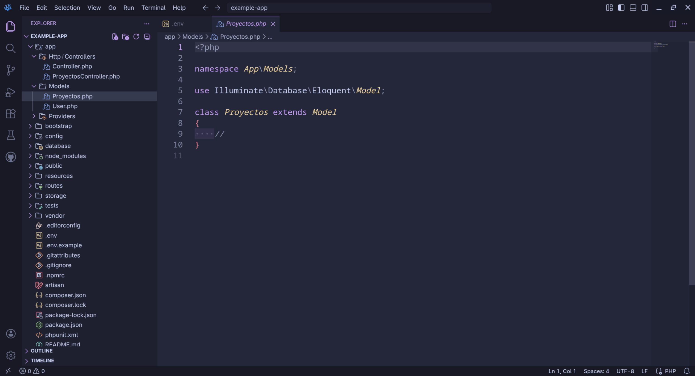

Se muestra el modelo `Proyectos.php`, ubicado en `app/Models/`.  
Este modelo representa la tabla `proyectos` y permite trabajar con los campos `nombre` y `descripcion` mediante asignación masiva.

---

### Captura 2 — Controlador `ProyectosController`

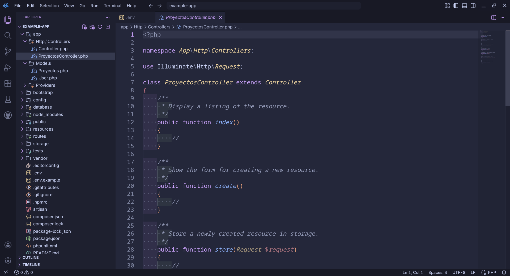

Se muestra el controlador `ProyectosController.php`, ubicado en `app/Http/Controllers/`.  
Este controlador administra las operaciones principales del recurso `projects`, como listar, crear, guardar, editar y actualizar proyectos.

---

### Captura 3 — Base de datos `prueba`

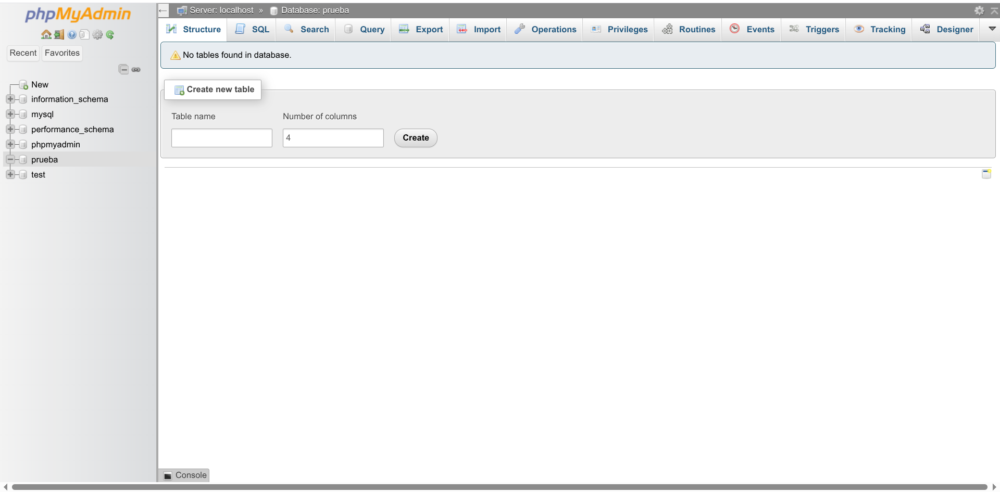

Se muestra phpMyAdmin con la base de datos `prueba` creada.  
Esta base de datos es la que se conecta con Laravel mediante la configuración del archivo `.env`.

---

### Captura 4 — Tablas generadas por migraciones

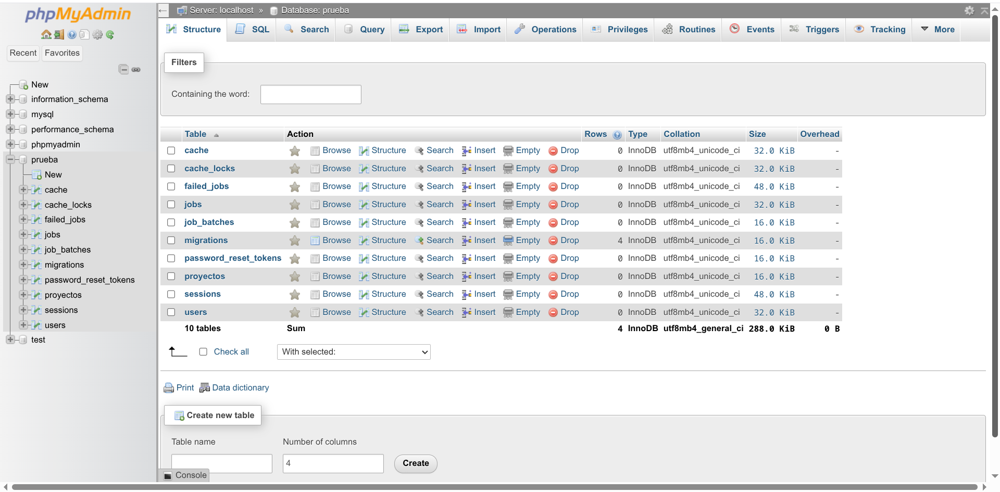

Se muestran las tablas creadas dentro de la base de datos `prueba`.  
Entre ellas aparece la tabla `proyectos`, generada mediante una migración de Laravel.

---

### Captura 5 — Inserción de datos desde phpMyAdmin

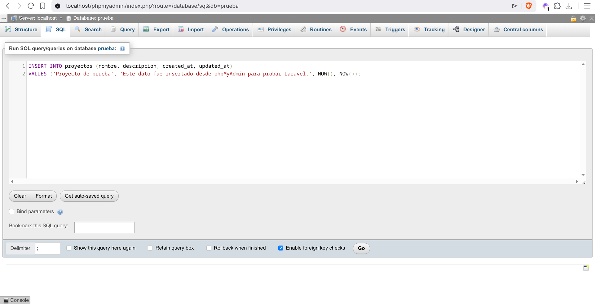

Se muestra la inserción de registros en la tabla `proyectos` usando una consulta SQL en phpMyAdmin.

---

### Captura 6 — Vista Blade del listado

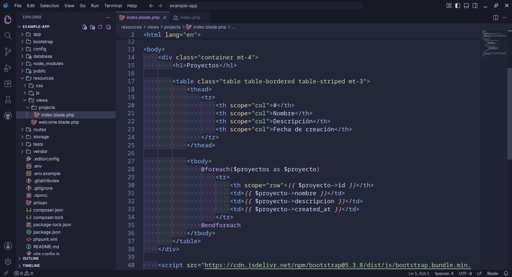

Se muestra el archivo `resources/views/projects/index.blade.php`.  
En esta vista se usa Bootstrap para mostrar los proyectos en una tabla HTML y se recorre la variable `$proyectos` mediante `@foreach`.

---

### Captura 7 — Inserción adicional desde phpMyAdmin


Se muestra una nueva consulta SQL ejecutada desde phpMyAdmin para agregar datos de prueba en la tabla `proyectos`.

---

### Captura 8 — Listado inicial de proyectos en Laravel

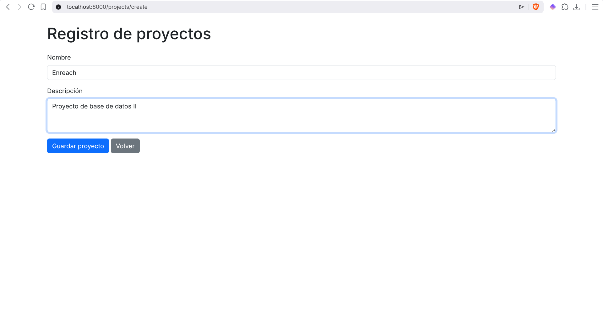

Se muestra la ruta `/projects` ejecutándose en el navegador.  
Laravel consulta la tabla `proyectos` y presenta los registros guardados en la base de datos.

---

### Captura 9 — Formulario de registro de proyectos


Se muestra la vista `resources/views/projects/new.blade.php`.  
Esta vista contiene un formulario con Bootstrap para registrar un nuevo proyecto con los campos `nombre` y `descripcion`.

---

### Captura 10 — Listado después de registrar proyectos

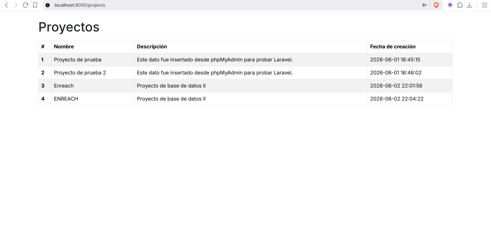

Se muestra el listado actualizado después de guardar nuevos proyectos desde el formulario de Laravel.  
Los registros creados aparecen en la tabla de la ruta `/projects`.

---

### Captura 11 — Formulario de actualización de proyecto

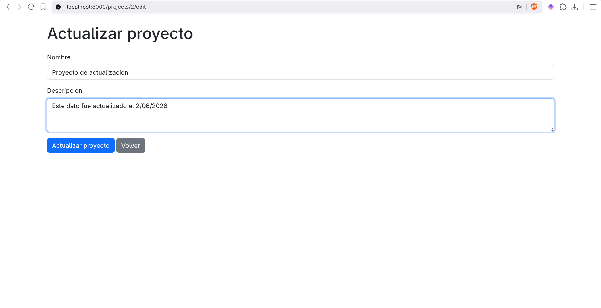

Se muestra la vista `resources/views/projects/update.blade.php`, cargada desde una ruta como `/projects/2/edit`.  
El formulario permite modificar el `nombre` y la `descripcion` de un proyecto existente.

---

### Captura 12 — Listado después de actualizar un proyecto

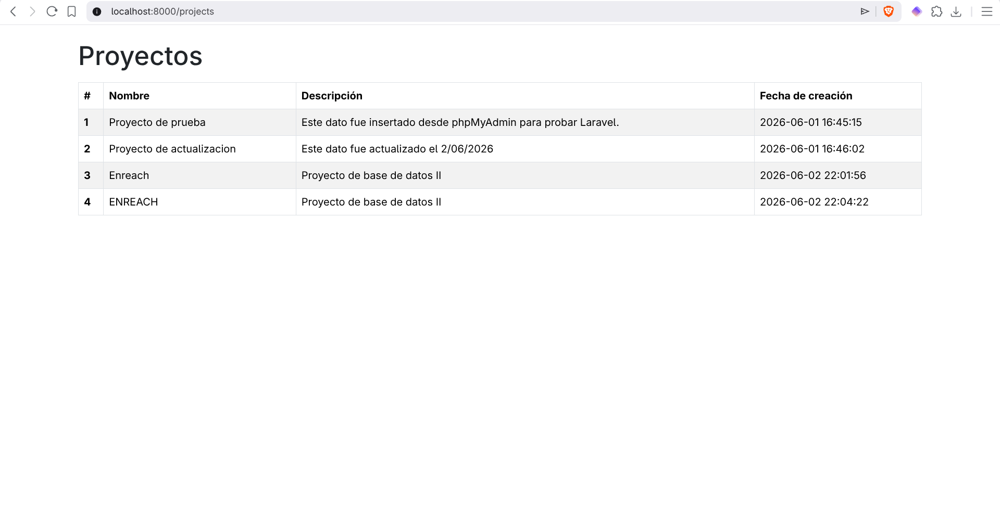

Se muestra el listado de proyectos después de ejecutar la actualización.  
El proyecto modificado aparece con los nuevos datos en la tabla principal.

---

### Captura 13 — Verificación de registros en phpMyAdmin

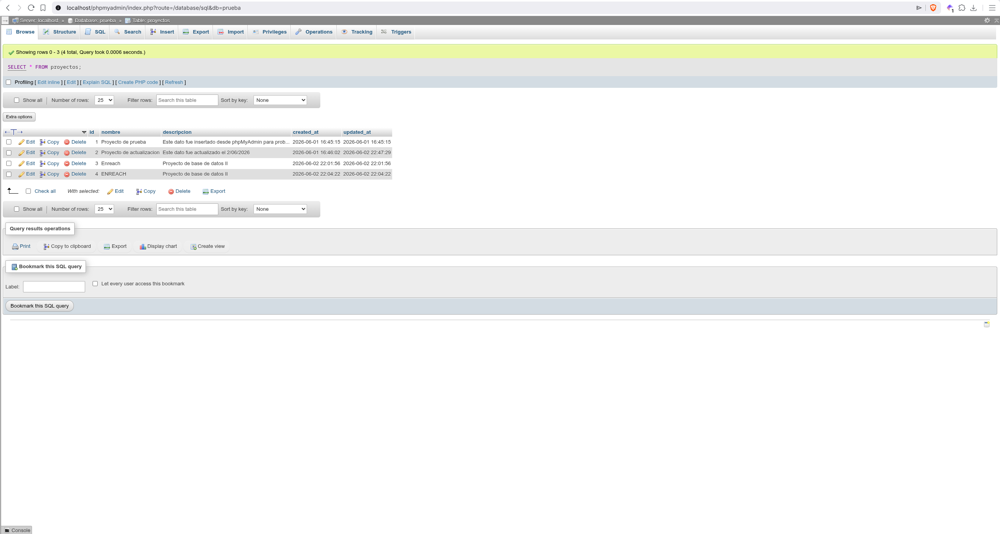

Se muestra phpMyAdmin con los registros almacenados en la tabla `proyectos`.  
Aquí se evidencia que los datos creados y actualizados desde Laravel también quedan guardados en la base de datos MariaDB.

---

## Tecnologías utilizadas

| Tecnología | Uso |
|---|---|
| Laravel | Framework PHP usado para crear la aplicación web. |
| PHP | Lenguaje base del proyecto. |
| Composer | Gestor de dependencias de Laravel. |
| MariaDB | Base de datos utilizada por medio de XAMPP. |
| phpMyAdmin | Herramienta web para administrar y verificar la base de datos. |
| Blade | Motor de plantillas de Laravel usado para las vistas. |
| Bootstrap 5.3 | Framework CSS usado para dar formato a tablas y formularios. |
| Artisan | Herramienta de comandos de Laravel. |

---

## Archivos principales del proyecto

| Archivo | Función |
|---|---|
| `app/Models/Proyectos.php` | Modelo que representa los registros de la tabla `proyectos`. |
| `app/Http/Controllers/ProyectosController.php` | Controlador que administra el listado, registro y actualización de proyectos. |
| `database/migrations/2026_05_28_213751_create_proyectos_table.php` | Migración que crea la tabla `proyectos`. |
| `resources/views/projects/index.blade.php` | Vista Blade que muestra los proyectos en una tabla con Bootstrap. |
| `resources/views/projects/new.blade.php` | Vista Blade con formulario para registrar nuevos proyectos. |
| `resources/views/projects/update.blade.php` | Vista Blade con formulario para actualizar proyectos existentes. |
| `routes/web.php` | Archivo donde se define la ruta recurso `projects`. |
| `.env` | Archivo local donde se configura la conexión con MariaDB. |

---

## Configuración de la base de datos

En el archivo `.env`, la conexión debe apuntar a la base `prueba`:

```env
DB_CONNECTION=mysql
DB_HOST=127.0.0.1
DB_PORT=3306
DB_DATABASE=prueba
DB_USERNAME=root
DB_PASSWORD=
```

La base de datos `prueba` debe estar creada previamente en phpMyAdmin.

---

## Migración de la tabla `proyectos`

La tabla `proyectos` se crea mediante una migración de Laravel:

```php
Schema::create('proyectos', function (Blueprint $table) {
    $table->id();
    $table->string('nombre', 100);
    $table->text('descripcion');
    $table->timestamps();
});
```

Para ejecutar la migración:

```bash
php artisan migrate
```

---

## Modelo `Proyectos`

El modelo permite trabajar con la tabla `proyectos` desde Eloquent:

```php
<?php

namespace App\Models;

use Illuminate\Database\Eloquent\Factories\HasFactory;
use Illuminate\Database\Eloquent\Model;

class Proyectos extends Model
{
    use HasFactory;

    protected $fillable = [
        'nombre',
        'descripcion',
    ];
}
```

La propiedad `$fillable` es necesaria porque en el controlador se usan métodos como `create()` y `update()` con los datos enviados desde el formulario.

---

## Ruta principal usada

En `routes/web.php` se define la ruta recurso:

```php
Route::resource("projects", ProyectosController::class);
```

Esta ruta genera automáticamente las rutas necesarias para listar, crear, guardar, editar y actualizar proyectos.

Rutas usadas en el taller:

```text
http://localhost:8000/projects
```

```text
http://localhost:8000/projects/create
```

```text
http://localhost:8000/projects/1/edit
```

---

## Funcionamiento del controlador

El controlador `ProyectosController.php` administra las operaciones principales del recurso `projects`.

### Listar proyectos

```php
public function index()
{
    $proyectos = DB::table('proyectos')->get();

    return view("projects.index", ['proyectos' => $proyectos]);
}
```

Este método consulta los registros de la tabla `proyectos` y los envía a la vista `projects.index`.

### Mostrar formulario de registro

```php
public function create()
{
    return view("projects.new");
}
```

Este método carga la vista `new.blade.php`, donde se encuentra el formulario para registrar proyectos.

### Guardar proyecto

```php
public function store(Request $request)
{
    $request->validate([
        'nombre' => 'required|max:255',
        'descripcion' => 'required',
    ]);

    Proyectos::create($request->all());

    return redirect('projects/')
        ->with('success', 'Proyecto creado satisfactoriamente.');
}
```

Este método recibe los datos del formulario, los guarda en la tabla `proyectos` y redirige al listado principal.

### Mostrar formulario de edición

```php
public function edit(string $id)
{
    $proyecto = Proyectos::findOrFail($id);

    return view("projects.update", compact('proyecto'));
}
```

Este método busca el proyecto por su `id` y lo envía a la vista `update.blade.php` para mostrar sus datos actuales.

### Actualizar proyecto

```php
public function update(Request $request, string $id)
{
    $request->validate([
        'nombre' => 'required|max:255',
        'descripcion' => 'required',
    ]);

    $proyecto = Proyectos::findOrFail($id);

    $proyecto->update($request->all());

    return redirect('projects/')
        ->with('success', 'Proyecto actualizado satisfactoriamente.');
}
```

Este método actualiza los datos del proyecto seleccionado y redirige nuevamente al listado.

---

## Vistas con Bootstrap

### Vista de listado `index.blade.php`

En `resources/views/projects/index.blade.php` se carga Bootstrap mediante CDN:

```html
<link href="https://cdn.jsdelivr.net/npm/bootstrap@5.3.8/dist/css/bootstrap.min.css" rel="stylesheet">
```

Luego se muestra la información en una tabla:

```blade
@foreach($proyectos as $proyecto)
    <tr>
        <th scope="row">{{ $proyecto->id }}</th>
        <td>{{ $proyecto->nombre }}</td>
        <td>{{ $proyecto->descripcion }}</td>
        <td>{{ $proyecto->created_at }}</td>
    </tr>
@endforeach
```

### Vista de registro `new.blade.php`

El formulario de registro usa el método `POST` y el token `@csrf`:

```blade
<form action="{{ route('projects.store') }}" method="POST" class="mt-4">
    @csrf

    <div class="mb-3">
        <label for="nombre" class="form-label">Nombre</label>
        <input type="text" class="form-control" id="nombre" name="nombre">
    </div>

    <div class="mb-3">
        <label for="descripcion" class="form-label">Descripción</label>
        <textarea class="form-control" id="descripcion" name="descripcion" rows="3"></textarea>
    </div>

    <button type="submit" class="btn btn-primary">Guardar proyecto</button>
</form>
```

### Vista de actualización `update.blade.php`

El formulario de actualización usa `POST` y simula el método `PUT` con `@method('PUT')`:

```blade
<form action="{{ route('projects.update', $proyecto->id) }}" method="POST" class="mt-4">
    @csrf
    @method('PUT')

    <div class="mb-3">
        <label for="nombre" class="form-label">Nombre</label>
        <input type="text" class="form-control" id="nombre" name="nombre" value="{{ $proyecto->nombre }}">
    </div>

    <div class="mb-3">
        <label for="descripcion" class="form-label">Descripción</label>
        <textarea class="form-control" id="descripcion" name="descripcion" rows="3">{{ $proyecto->descripcion }}</textarea>
    </div>

    <button type="submit" class="btn btn-primary">Actualizar proyecto</button>
</form>
```

`@method('PUT')` se usa porque los formularios HTML solo permiten `GET` y `POST`, mientras que Laravel utiliza `PUT` para actualizar recursos.

---

## Inserción y verificación de datos

Al inicio se insertaron datos de prueba desde phpMyAdmin con SQL:

```sql
INSERT INTO proyectos (nombre, descripcion, created_at, updated_at)
VALUES
('Proyecto de prueba', 'Este dato fue insertado desde phpMyAdmin para probar Laravel.', NOW(), NOW()),
('Proyecto de prueba 2', 'Este dato fue insertado desde phpMyAdmin para probar Laravel.', NOW(), NOW());
```

Luego se agregaron y actualizaron registros desde los formularios de Laravel.  
Los cambios se verificaron tanto en la ruta `/projects` como en phpMyAdmin.

---

## Comandos usados

Para ejecutar migraciones:

```bash
php artisan migrate
```

Para levantar el servidor local:

```bash
php artisan serve
```

Para revisar las rutas registradas:

```bash
php artisan route:list
```

Si se necesita limpiar la configuración cacheada:

```bash
php artisan config:clear
php artisan cache:clear
```

---

## Ejecución del proyecto

Para ejecutar el proyecto localmente:

```bash
php artisan serve
```

Luego se abre en el navegador:

```text
http://localhost:8000/projects
```

Para registrar un proyecto:

```text
http://localhost:8000/projects/create
```

Para editar un proyecto existente:

```text
http://localhost:8000/projects/1/edit
```

---
